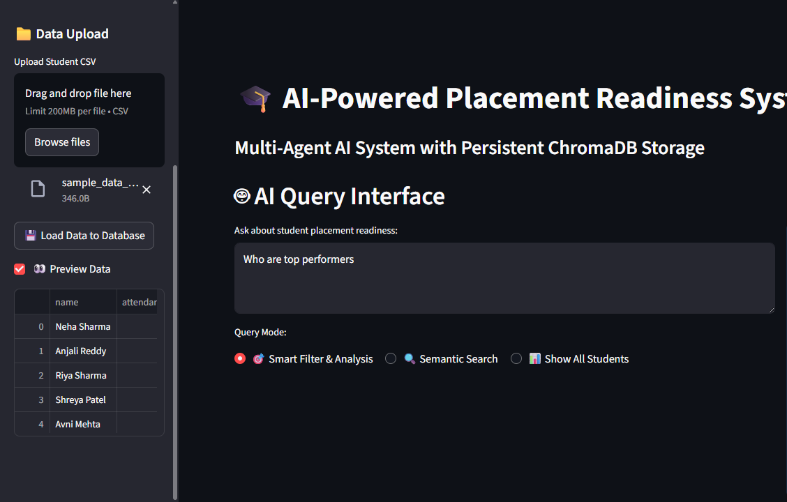

# 🎓 AI-Powered Placement Readiness System

An intelligent multi-agent system for evaluating student placement readiness using ChromaDB for persistent storage, LangChain for AI orchestration, and Streamlit for the user interface.

## 🌟 Features

### Multi-Agent Architecture

- **🧠 Academic Performance Agent**: Evaluates academic metrics using LangChain prompts
- **💬 Soft Skills Agent**: Analyzes communication skills from LinkedIn/resume data
- **📈 Readiness Analysis Agent**: Calculates overall placement readiness scores
- **🎯 Intervention Agent**: Provides personalized improvement recommendations
- **🔍 Query Analysis Agent**: Intelligently filters students based on natural language queries
- **💡 RAG Response Agent**: Generates comprehensive responses using retrieved data

### Advanced Data Management

- **🗄️ ChromaDB Integration**: Persistent vector database for efficient data storage and retrieval
- **🔍 Semantic Search**: Find students using natural language queries
- **📊 Smart Filtering**: AI-powered student filtering based on complex criteria
- **💾 Data Persistence**: All data is stored persistently and survives application restarts

### Modern AI Stack

- **🔗 LangChain Framework**: Structured prompt templates and AI orchestration
- **🤖 Multiple LLM Support**: Google Gemini and HuggingFace models
- **📝 Prompt Engineering**: Optimized prompts for consistent, high-quality outputs
- **🎯 Context-Aware Responses**: RAG (Retrieval-Augmented Generation) for accurate answers

## 🚀 Quick Start

### 1. Installation

```bash
# Clone the repository
git clone <repository-url>
cd placement-readiness-system

# Install dependencies
pip install -r requirements.txt
```

### 2. Setup API Keys

```bash
add api key for gemini and hugging face in model_utils.py
```

Or update the API keys directly in `config.py`.

### 3. Run the Application

```bash
# Using the run script (recommended)
python run_app.py

# Or directly with Streamlit
streamlit run app.py
```

### 4. Access the Application

Open your browser and navigate to `http://localhost:8501`

## 📋 CSV Data Format

Upload CSV files with the following columns:

| Column                  | Description                       | Example                   |
| ----------------------- | --------------------------------- | ------------------------- |
| `name`                  | Student's full name               | "John Doe"                |
| `attendance`            | Attendance percentage (0-100)     | 85                        |
| `test_score`            | Average test score (0-100)        | 78                        |
| `assignment_percentage` | Assignment completion (0-100)     | 90                        |
| `event_participation`   | Event participation (Yes/No)      | "Yes"                     |
| `softskill_score`       | Initial soft skills score (0-100) | 75                        |
| `linkedin_bio`          | LinkedIn biography (optional)     | "Software developer..."   |
| `resume_text`           | Resume summary (optional)         | "Experience in Python..." |

## 🏗️ System Architecture

```
┌─────────────────┐    ┌─────────────────┐    ┌─────────────────┐
│   Streamlit UI  │    │  Multi-Agent    │    │   ChromaDB      │
│                 │◄──►│    System       │◄──►│   Database      │
│  - File Upload  │    │                 │    │                 │
│  - Query Input  │    │ - 6 Specialized │    │ - Vector Store  │
│  - Results      │    │   Agents        │    │ - Persistence   │
└─────────────────┘    └─────────────────┘    └─────────────────┘
         ▲                       ▲
         │                       │
         ▼                       ▼
┌─────────────────┐    ┌─────────────────┐
│   LangChain     │    │  Google Gemini  │
│                 │    │                 │
│ - Prompt Mgmt   │    │ - LLM Inference │
│ - Agent Coord   │    │ - Text Analysis │
└─────────────────┘    └─────────────────┘
```

## 🤖 Agent Workflows

### Academic Performance Agent

```python
Input: attendance, test_score, assignment_percentage, event_participation
Processing: Weighted scoring with LangChain prompt templates
Output: Academic score (0-100) + reasoning
```

### Soft Skills Agent

```python
Input: linkedin_bio, resume_text
Processing: NLP analysis of communication quality
Output: Communication score (0-100) + assessment
```

### Readiness Analysis Agent

```python
Input: academic_score, communication_score
Processing: Weighted combination (60% academic, 40% communication)
Output: Overall readiness score + detailed analysis
```

## 📊 Usage Examples

### Smart Query Examples

```
"Show students below 70%"
→ Filters students with overall scores < 70%

"How can John Smith improve?"
→ Shows John's profile with personalized recommendations

"Who are the top performers?"
→ Displays highest-scoring students

"Students with communication issues"
→ Filters students with low communication scores

"Compare engineering students"
→ Semantic search for engineering-related profiles
```

### Semantic Search Examples

```
"Python developers"
→ Finds students with Python experience in their profiles

"Data science background"
→ Retrieves students with data science keywords

"Strong academic performance"
→ Finds high-performing students using vector similarity
```

## 🔧 Configuration

Edit `config.py` to customize:

- **Database settings**: ChromaDB path and collection name
- **Model parameters**: Temperature, max tokens, model selection
- **Scoring weights**: Academic and readiness calculation weights
- **Performance thresholds**: Score boundaries for classifications
- **UI settings**: Page title, themes, layouts

## 📁 File Structure

```
placement-readiness-system/
├── app.py                 # Main Streamlit application
├── database_utils.py      # ChromaDB operations
├── model_utils.py         # LLM setup and prompt templates
├── agents.py             # Multi-agent system implementation
├── rag_utils.py          # RAG system and utilities
├── config.py             # Configuration settings
├── run_app.py            # Application runner script
├── requirements.txt      # Python dependencies
├── README.md            # This file
└── chroma_db/           # ChromaDB storage (auto-created)
```

## 🎯 Key Features Explained

### 1. Persistent Storage

- All student data is stored in ChromaDB
- Data survives application restarts
- Efficient vector-based search and retrieval
- Automatic embedding generation for semantic search

### 2. Multi-Agent Processing

- Each agent has a specialized role and prompt template
- Consistent, structured outputs using LangChain
- Error handling and fallback mechanisms
- Coordinated workflow through the MultiAgentSystem class

### 3. Intelligent Querying

- Natural language query understanding
- Smart filtering based on AI interpretation
- Semantic search using vector embeddings
- Context-aware response generation

### 4. Comprehensive Analysis

- Academic performance evaluation
- Soft skills assessment
- Overall readiness calculation
- Personalized improvement recommendations

## 🛠️ Advanced Usage

### Adding New Agents

```python
class CustomAgent(BaseAgent):
    def evaluate(self, student_data: Dict) -> Tuple[float, str]:
        # Custom evaluation logic
        return score, reasoning
```

### Custom Prompt Templates

```python
CUSTOM_PROMPT = PromptTemplate(
    input_variables=["input1", "input2"],
    template="Your custom prompt template here..."
)
```

### Database Operations

```python
# Direct database access
from database_utils import StudentDatabase

db = StudentDatabase()
students = db.search_students("your query")
```

## 🤝 Contributing

1. Fork the repository
2. Create a feature branch
3. Make your changes
4. Add tests if applicable
5. Submit a pull request

## 📝 License

This project is licensed under the MIT License.

## 🆘 Support

For issues and questions:

1. Check the troubleshooting section below
2. Review the configuration settings
3. Ensure all dependencies are installed
4. Verify API keys are correctly set

## 🔧 Troubleshooting

### Common Issues

**ChromaDB Connection Error**

```bash
# Solution: Ensure the chroma_db directory exists
mkdir chroma_db
```

**API Key Error**

```bash
# Solution: Set environment variables or update
```
